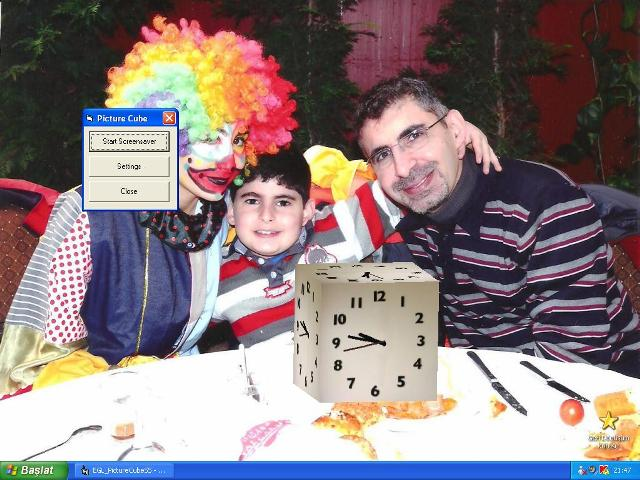



## EGL\_ClockCubeScreenSaver

### Description

BugFix :Error 326. Thnx Robert Rayment and Paul Bahlawan for feedback. By the way Update clock hands color and setup defaults.

Real time 3D clock cube screensaver. Supported bilinear filtering. Pure VB.(267 KB)(Rev:11.Feb.2011)
 
### More Info
 

             |
---                |---
**Submitted On**   |2011-02-10 00:45:08
**By**             |[Erkan Sanli](https://github.com/Planet-Source-Code/PSCIndex/blob/master/ByAuthor/erkan-sanli.md)
**Level**          |Advanced
**User Rating**    |5.0 (218 globes from 44 users)
**Compatibility**  |VB 4\.0 \(32\-bit\), VB 5\.0, VB 6\.0
**Category**       |[Graphics](https://github.com/Planet-Source-Code/PSCIndex/blob/master/ByCategory/graphics__1-46.md)
**World**          |[Visual Basic](https://github.com/Planet-Source-Code/PSCIndex/blob/master/ByWorld/visual-basic.md)
**Archive File**   |[EGL\_ClockC2197882112011\.zip](https://github.com/Planet-Source-Code/erkan-sanli-egl-clockcubescreensaver__1-70182/archive/master.zip)

